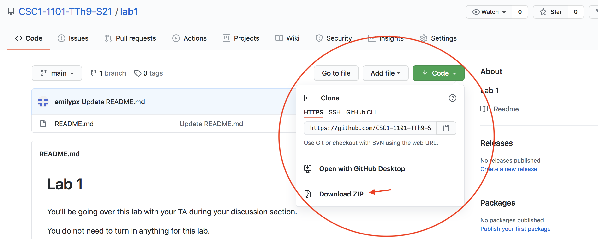

# Week 2 Lab

You'll be going over this lab with your TA during your discussion section.

You do not need to turn in anything for this lab.

**Don't forget that your TA will be taking attendance!** Your attendance will contribute to your overall Class Participation grade. Students who routinely skip their discussion section will get a low grade, even if they come to class regularly. Class participation is worth 5% of your final grade, so getting a low score could be the difference between an A and an A-.

## Reading
[You can read the first few sections of this as you're learning.](https://realpython.com/python-idle/) You can stop at "Improving your Workflow".

## Code
In this repository (a.k.a. folder), you'll find a few scripts that the TAs will show you how to run.


## Getting started
1. Create a folder on your Desktop or in your Documents or anywhere that's easy to access called `CS1`. This will be where you keep all your assignments for this class.

2. On this page, you'll see a green `Code` button. Click on that button and select `Download ZIP`. Here's a picture to help:




3. On your computer, move the ``lab1-main`` folder you just downloaded to your `CS1` folder.

4a. There are two ways of opening a Python (``.py``) file. Let's try one way first to see if it works.

  * Open the `lab1-main` folder on your computer, then you'll see a file called `myfirstprogram.py`. (Your operating system might just show it as as `myfirstprogram`. That's fine -- it's the file you want.) 
  * **Right-click** on the `myfirstprogram.py` file. On a Mac, you can right-click by tapping the icon with two fingers or by holding down the ``control`` key and then tapping the icon.
  * Select `Open with...` and then select IDLE from the submenu.
  * If IDLE does not appear or you can't figure out how to right click, try option 4b.

4b. If 4a didn't work, try this. 
  * find IDLE, the Python IDE application you downloaded and installed in the first problem set. 
  * Launch IDLE! (On a Mac it might be called ``IDLE.app``, and on a Windows machine it might be called ``IDLE.exe`` or ``IDLE.bat``.)
  * From the `File` menu in IDLE, select `Open`. Then navigate to the `lab1-main` folder, and select `myfirstprogram.py` (which your OS might show just as `myfirstprogram`).
  
5. Once you have launched IDLE and you have `myfirstprogram.py` open, click on the `myfirstprogram.py` window to make it the active window. Then go up to the `Run` dropdown menu, and select `Run Module`. In the `IDLE Shell` window, you'll see output something like this.

```
=========== RESTART: /Users/emilypx/Desktop/myfirstprogram.py ===========
Hello, World!
>>> 
```

## Getting more advanced
Now open the `mysecondprogram.py` just as you opened `myirstprogram.py`, above. You ran run it just as you ran the other program. This is a little more fancy! You can learn more about what the program is doing and what is happening by looking in the comments. The TA will discuss it more with you.

Why "Hello, World!"? [Read more about it here!](https://en.wikipedia.org/wiki/%22Hello,_World!%22_program)

## Getting even more advanced!
Now open the `mythirdprogram.py` just as you opened `myirstprogram.py`, above. You ran run it just as you ran the other program. This is even more fancy! You can learn more about what the program is doing and what is happening by looking in the comments. The TA will discuss it more with you.


